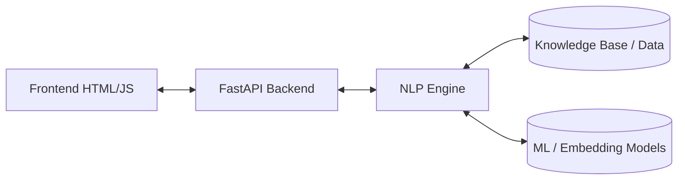
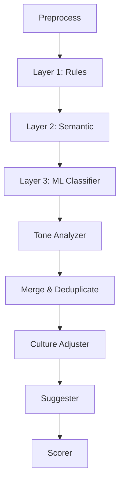

# CultureLens - Cross-Cultural Communication Advisor

CultureLens is a mini-project for an NLP course that detects phrases likely to cause misunderstanding in international business communication. It analyzes English text and highlights idioms, slang, ambiguous dates, and tone mismatches depending on the specific sender and recipient cultures.


## Problem Statement and Scope
**Problem:** In cross-cultural business settings, phrases like "touch base", ambiguous dates like "03/04/2026", or overly blunt feedback can cause serious misunderstandings. 
**Scope:** CultureLens focuses on explaining *why* a phrase is risky for a specific target culture, providing clear alternatives, and scoring the overall risk. It does not do translation or generative LLM rewriting, but relies on a predictable, explainable NLP pipeline.

## Architecture Overview

**System Architecture**


**NLP Pipeline**


## Folder Structure
- `backend/`: FastAPI app, Pydantic schemas, and thin routing service.
- `data/`: JSON knowledge bases (phrases, cultures) and ML training data.
- `frontend/`: Single-page vanilla JS UI (HTML, CSS, JS).
- `models/`: Saved models (.joblib, .npy).
- `nlp_engine/`: The core NLP pipeline modules (rules, semantic, ml, tone, merge, scorer, etc.).
- `scripts/`: Training and evaluation scripts.
- `tests/`: Pytest suite (API, Pipeline, Rules).

## NLP Concepts Used
- **Tokenization, Lemmatization, POS tagging, Dependency parsing**: Used in `preprocess.py` and `tone_analyzer.py` via `spaCy` to break text into words, find base forms (e.g. "touching" -> "touch"), identify verbs, and find imperative roots without subjects.
- **PhraseMatcher/Rule-based matching**: Used in `rule_detector.py` to exactly match known risky idioms using spaCy's optimized lemma matching.
- **TF-IDF & Logistic Regression**: Used in `ml_classifier.py` and `scripts/train_classifier.py`. TF-IDF extracts word/character n-grams as features, and Logistic Regression classifies the sentence's tone/risk.
- **Sentence Embeddings & Cosine Similarity**: Used in `semantic_detector.py` via `sentence-transformers` to catch paraphrased idioms (e.g., "let's hit a home run") by measuring vector distance to known phrases.
- **VADER Sentiment**: Used in `tone_analyzer.py` for a lightweight polarity signal to catch extreme bluntness or sarcasm cues.

## Why a Hybrid Approach?
- **Rules (Layer 1)**: High precision, 100% explainable, fast. Fails on paraphrases or unseen phrases. Example: catches exactly "touch base".
- **Semantic (Layer 2)**: Catches variations and unseen idioms by embedding similarity. Slower, might over-flag. Example: catches "make contact with base".
- **ML Classifier (Layer 3)**: Catches holistic sentence-level issues (like vague wording or bluntness) that aren't tied to a specific phrase. Requires training data. Example: catches "This is entirely wrong and needs a rewrite".

## Scoring Formula
The overall risk score (0-100) is calculated as:
`score = min(100, 100 * (1 - exp(-k * sum(severity * confidence / sqrt(sentences)))))`
*Example:* If we have 4 sentences, and 2 flags with severity 3, confidence 0.9. Sum = (3*0.9 + 3*0.9) = 5.4. Div by sqrt(4) = 2.7. If k=0.25, exp(-0.25*2.7) = 0.509. Score = 100 * (1 - 0.509) = 49.1 (Moderate).

## Culture Model
We use simplified dimensions inspired by Edward Hall (high/low context) and Hofstede (power distance, etc.) on a 0-1 scale. A Euclidean distance between the sender and recipient cultures adjusts the base risk of any flagged phrase. 

## API Reference
**POST /api/analyze**
```json
{
  "text": "Let's touch base ASAP.",
  "source_culture": "usa",
  "target_culture": "japan",
  "options": {"use_semantic": true, "use_ml": true, "use_tone": true}
}
```
*Returns:*
```json
{
  "flags": [{"text": "touch base", "category": "idiom", "severity": 2, ...}],
  "risk_score": 42.5,
  "risk_label": "Moderate",
  "suggested_rewrite": "Let's have a short call ASAP."
}
```

## Setup and Run
**Windows:**
1. Run `.\setup.bat`
2. Run `.\run.bat`
3. Open `http://localhost:8000`

**macOS / Linux:**
1. Run `./setup.sh`
2. Run `./run.sh`
3. Open `http://localhost:8000`

*Troubleshooting:* If `sentence-transformers` fails to download on the first run, the system degrades gracefully and disables the semantic layer.

## Customization
- **Retrain the classifier:** Add rows to `data/training_data.csv` and run `python scripts/train_classifier.py`.
- **Add a phrase:** Add a JSON object to `data/phrases.json` (requires restarting the server).
- **Add a culture:** Add a JSON object to `data/cultures.json`.

## Evaluation Results
On our hand-crafted 40-sentence held-out evaluation set covering complex edge cases (idioms, ambiguous dates, sarcasm, directness mismatches):
- **Precision:** 0.6667
- **Recall:** 0.7692
- **F1 Score:** 0.7143
See `docs/evaluation_report.md` for a breakdown of misses and false positives.

## Limitations and Ethics
- **Stereotype Risk:** Cultural dimensions are generalizations. Individuals vary greatly.
- **Language:** English only.
- **Data:** Small educational dataset; the ML classifier is trained on a synthetic dataset of 400 sentences.
- **Overlapping Phrases:** Overlapping flags are resolved by strict precedence rules (Rule > Semantic > ML), meaning a sentence that is both a sports metaphor and overly blunt might only highlight the metaphor depending on confidence.
- **Re-Analyze Behavior:** If you click the "Re-analyze" button in the UI, it places the *rewritten* text back into the engine. Since the risky idioms have been swapped for clear language, it is expected and intended that subsequent re-analyses will result in a "No major cultural misunderstandings detected" outcome!
- Not a replacement for human empathy and judgment.

## Viva Cheat-Sheet
1. **Why not just use ChatGPT?** LLMs are slow, expensive, a black box, and hard to host locally. Our hybrid pipeline is fast, 100% local, explainable, and deterministic.
2. **Why both rules and ML?** Rules provide perfect precision for known idioms. ML provides recall for unseen or sentence-level issues.
3. **How do you handle false positives?** We merge overlapping flags, prefer exact rules over ML, and adjust severity downwards for similar cultures.
4. **What is cosine similarity?** A measure of the angle between two vectors, used to see if an unknown phrase points in the same semantic direction as a known idiom.
5. **How did you evaluate?** We hand-crafted a 40-sentence held-out eval set covering complex edge cases and ran automated P/R/F1 scoring against it.
